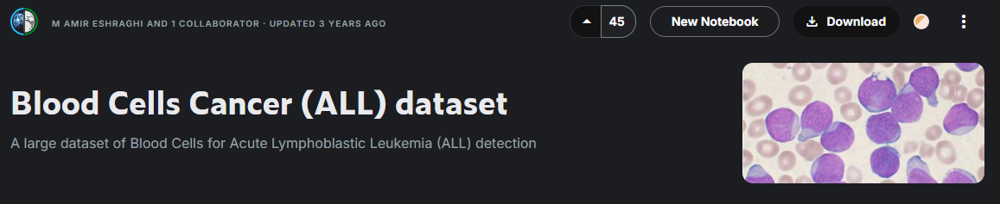
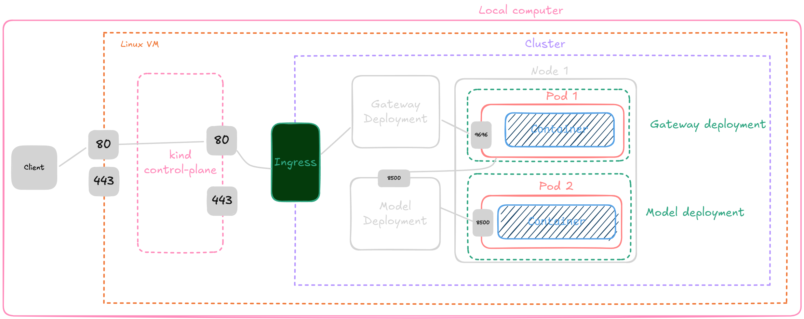
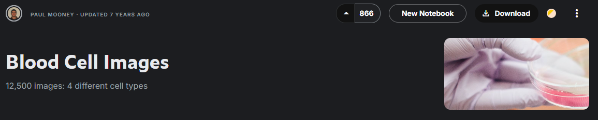
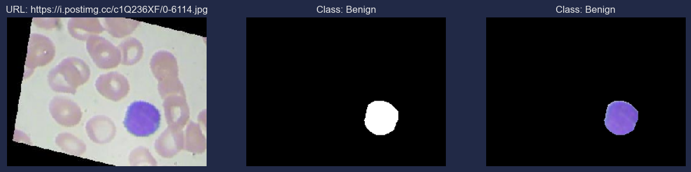
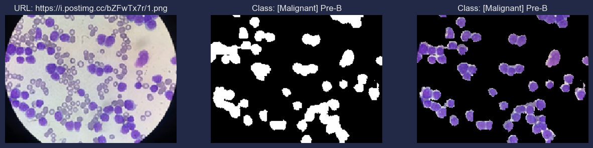
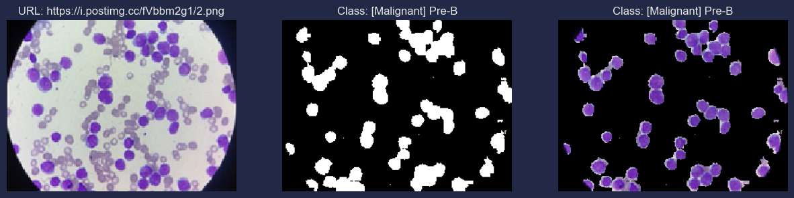
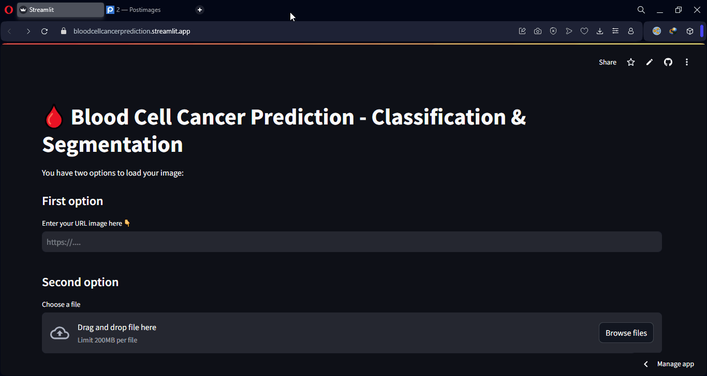

# 🩸 Blood Cell Cancer Prediction: Classification and Segmentation

<a href="https://www.kaggle.com/code/aletbm/blood-cell-cancer-prediction?scriptVersionId=215165243" target="_blank"></a>
<a href="https://colab.research.google.com/github/aletbm/MySolutions_MLZoomcamp2024_DataTalks.Club/blob/main/Blood_Cell_Cancer_Prediction_Capstone_1/analysis/blood_cell_cancer_prediction_Colab.ipynb" target="_parent"></a>
<a href="https://bloodcellcancerprediction.streamlit.app" target="_parent"></a>

This repository was created as part of [the DataTalks.Club's Machine Learning Zoomcamp](https://github.com/alexeygrigorev) by [Alexey Grigorev](https://github.com/alexeygrigorev).

This project has been submitted as the Capstone 1 project for the course.

---
## Overview
Acute lymphocytic leukemia (ALL) is a type of cancer of the blood and bone marrow (the spongy tissue inside bones where blood cells are made).

Acute lymphocytic leukemia is the most common type of cancer in children, and treatments result in a good chance for a cure. Acute lymphocytic leukemia can also occur in adults, though the chance of a cure is greatly reduced.

## Causes
Acute lymphocytic leukemia occurs when a bone marrow cell develops changes (mutations) in its genetic material or DNA. A cell's DNA contains the instructions that tell a cell what to do. Normally, the DNA tells the cell to grow at a set rate and to die at a set time. In acute lymphocytic leukemia, the mutations tell the bone marrow cell to continue growing and dividing.

When this happens, blood cell production becomes out of control. The bone marrow produces immature cells that develop into leukemic white blood cells called lymphoblasts. These abnormal cells are unable to function properly, and they can build up and crowd out healthy cells.

## ALL Subtypes
Doctors classify acute lymphoblastic leukemia (ALL) into subtypes by using various tests. It's important to get an accurate diagnosis since your subtype plays a large part in deciding the type of treatment you'll receive. Depending on your ALL subtype, the doctor will determine

+ The type of drug combination needed for your treatment
+ The length of time you'll need to be in treatment
+ Other types of treatment that may be needed to achieve the best outcomes

Based on immunophenotyping of the leukemia cell, the World Health Organization (WHO) classifies ALL into two main subtypes.

+ **B-cell lymphoblastic leukemia/lymphoma**: This subtype begins in immature cells that would normally develop into B-cell lymphocytes. This is the most common ALL subtype. Among adults, B-cell lineage represents 75 percent of cases.
+ **T-cell lymphoblastic leukemia**: This subtype of ALL originates in immature cells that would normally develop into T-cell lymphocytes. This subtype is less common, and it occurs more often in adults than in children. Among adults, T-cell lineage represents about 25 percent of cases.


The final task of the lymphocytes (B cells) developed in the bone marrow (BM) is the production of antigen-specific immunoglobulins (IGS), which function as antibodies. IGS are proteins secreted by or present on the surface of B cells, assembled from identical pairs of heavy (H) and light (L) chains.

Antibody structure<br>


Before being capable of producing Ag-specific IGS, B cells must undergo a number of transformations, first in the BM and subsequently in the lymph nodes (LNs). The first stages of B-cell development occur in the BM, where pro-B cells first rearrange the Ig H chain gene to become pre-B cells. Pre-B cells continue this somatic recombination process by rearranging the L chain to become immature B cells, expressing IgM on their surface.

B-cell development<br>


---
# Directory structure

### 📂 Blood_Cell_Cancer_Prediction_Capstone_1
* 📄 [README.md](https://github.com/aletbm/MySolutions_MLZoomcamp2024_DataTalks.Club/blob/main/Blood_Cell_Cancer_Prediction_Capstone_1/README.md)
* 📄 [Pipfile](https://github.com/aletbm/MySolutions_MLZoomcamp2024_DataTalks.Club/blob/main/Blood_Cell_Cancer_Prediction_Capstone_1/Pipfile)
* 📄 [Pipfile.lock](https://github.com/aletbm/MySolutions_MLZoomcamp2024_DataTalks.Club/blob/main/Blood_Cell_Cancer_Prediction_Capstone_1/Pipfile.lock)
* 📂 [analysis](https://github.com/aletbm/MySolutions_MLZoomcamp2024_DataTalks.Club/tree/main/Blood_Cell_Cancer_Prediction_Capstone_1/analysis)
    * 📊 [blood-cell-cancer-prediction.ipynb](https://github.com/aletbm/MySolutions_MLZoomcamp2024_DataTalks.Club/blob/main/Blood_Cell_Cancer_Prediction_Capstone_1/analysis/blood-cell-cancer-prediction.ipynb)
    * 📖 [blood-cell-cancer-prediction.pdf](https://github.com/aletbm/MySolutions_MLZoomcamp2024_DataTalks.Club/blob/main/Blood_Cell_Cancer_Prediction_Capstone_1/analysis/blood-cell-cancer-prediction.pdf)
    * 📊 [blood_cell_cancer_prediction_Colab.ipynb](https://github.com/aletbm/MySolutions_MLZoomcamp2024_DataTalks.Club/blob/main/Blood_Cell_Cancer_Prediction_Capstone_1/analysis/blood_cell_cancer_prediction_Colab.ipynb)
    * 📊 [test_deploy.ipynb](https://github.com/aletbm/MySolutions_MLZoomcamp2024_DataTalks.Club/blob/main/Blood_Cell_Cancer_Prediction_Capstone_1/analysis/test_deploy.ipynb)
* 📂 [dataset](https://github.com/aletbm/MySolutions_MLZoomcamp2024_DataTalks.Club/tree/main/Blood_Cell_Cancer_Prediction_Capstone_1/dataset)
    * 🗄️ [blood_cell_cancer_with_mask_test.tfrecord](https://github.com/aletbm/MySolutions_MLZoomcamp2024_DataTalks.Club/blob/main/Blood_Cell_Cancer_Prediction_Capstone_1/dataset/blood_cell_cancer_with_mask_test.tfrecord)
    * 🗄️ [blood_cell_cancer_with_mask_train.tfrecord](https://github.com/aletbm/MySolutions_MLZoomcamp2024_DataTalks.Club/blob/main/Blood_Cell_Cancer_Prediction_Capstone_1/dataset/blood_cell_cancer_with_mask_train.tfrecord)
    * 🗄️ [blood_cell_cancer_with_mask_val.tfrecord](https://github.com/aletbm/MySolutions_MLZoomcamp2024_DataTalks.Club/blob/main/Blood_Cell_Cancer_Prediction_Capstone_1/dataset/blood_cell_cancer_with_mask_val.tfrecord)
* 📂 [etc](https://github.com/aletbm/MySolutions_MLZoomcamp2024_DataTalks.Club/tree/main/Blood_Cell_Cancer_Prediction_Capstone_1/etc)
    * 📄 [deploy.sh](https://github.com/aletbm/MySolutions_MLZoomcamp2024_DataTalks.Club/blob/main/Blood_Cell_Cancer_Prediction_Capstone_1/etc/deploy.sh)
    * ⚙️ [gateway-deployment-service.yaml](https://github.com/aletbm/MySolutions_MLZoomcamp2024_DataTalks.Club/blob/main/Blood_Cell_Cancer_Prediction_Capstone_1/etc/gateway-deployment-service.yaml)
    * ⚙️ [gateway-deployment.yaml](https://github.com/aletbm/MySolutions_MLZoomcamp2024_DataTalks.Club/blob/main/Blood_Cell_Cancer_Prediction_Capstone_1/etc/gateway-deployment.yaml)
    * 🐋 [gateway.dockerfile](https://github.com/aletbm/MySolutions_MLZoomcamp2024_DataTalks.Club/blob/main/Blood_Cell_Cancer_Prediction_Capstone_1/etc/gateway.dockerfile)
    * ⚙️ [kind-config.yaml](https://github.com/aletbm/MySolutions_MLZoomcamp2024_DataTalks.Club/blob/main/Blood_Cell_Cancer_Prediction_Capstone_1/etc/kind-config.yaml)
    * ⚙️ [metallb-configmap.yaml](https://github.com/aletbm/MySolutions_MLZoomcamp2024_DataTalks.Club/blob/main/Blood_Cell_Cancer_Prediction_Capstone_1/etc/metallb-configmap.yaml)
    * ⚙️ [model-deployment.yaml](https://github.com/aletbm/MySolutions_MLZoomcamp2024_DataTalks.Club/blob/main/Blood_Cell_Cancer_Prediction_Capstone_1/etc/model-deployment.yaml)
    * ⚙️ [model-service.yaml](https://github.com/aletbm/MySolutions_MLZoomcamp2024_DataTalks.Club/blob/main/Blood_Cell_Cancer_Prediction_Capstone_1/etc/model-service.yaml)
    * ⚙️ [nginx-ingress.yaml](https://github.com/aletbm/MySolutions_MLZoomcamp2024_DataTalks.Club/blob/main/Blood_Cell_Cancer_Prediction_Capstone_1/etc/nginx-ingress.yaml)
    * 🐋 [serving.dockerfile](https://github.com/aletbm/MySolutions_MLZoomcamp2024_DataTalks.Club/blob/main/Blood_Cell_Cancer_Prediction_Capstone_1/etc/serving.dockerfile)
* 📂 [models](https://github.com/aletbm/MySolutions_MLZoomcamp2024_DataTalks.Club/tree/main/Blood_Cell_Cancer_Prediction_Capstone_1/models)
    * 🤖 [model_backbone.keras](https://github.com/aletbm/MySolutions_MLZoomcamp2024_DataTalks.Club/blob/main/Blood_Cell_Cancer_Prediction_Capstone_1/models/model_backbone.keras)
    * 🤖 [model_base.keras](https://github.com/aletbm/MySolutions_MLZoomcamp2024_DataTalks.Club/blob/main/Blood_Cell_Cancer_Prediction_Capstone_1/models/model_base.keras)
    * 🤖 [model_base_aug.keras](https://github.com/aletbm/MySolutions_MLZoomcamp2024_DataTalks.Club/blob/main/Blood_Cell_Cancer_Prediction_Capstone_1/models/model_base_aug.keras)
    * 🤖 [model_base_segmentation.keras](https://github.com/aletbm/MySolutions_MLZoomcamp2024_DataTalks.Club/blob/main/Blood_Cell_Cancer_Prediction_Capstone_1/models/model_base_segmentation.keras)
    * 🤖 [model_base_segmentation_aug.keras](https://github.com/aletbm/MySolutions_MLZoomcamp2024_DataTalks.Club/blob/main/Blood_Cell_Cancer_Prediction_Capstone_1/models/model_base_segmentation_aug.keras)
    * 🤖 [model_seg_clf.keras](https://github.com/aletbm/MySolutions_MLZoomcamp2024_DataTalks.Club/blob/main/Blood_Cell_Cancer_Prediction_Capstone_1/models/model_seg_clf.keras)
    * 🤖 [model_seg_clf_aug.keras](https://github.com/aletbm/MySolutions_MLZoomcamp2024_DataTalks.Club/blob/main/Blood_Cell_Cancer_Prediction_Capstone_1/models/model_seg_clf_aug.keras)
* 📂 [scripts](https://github.com/aletbm/MySolutions_MLZoomcamp2024_DataTalks.Club/tree/main/Blood_Cell_Cancer_Prediction_Capstone_1/scripts)
    * 🐍 [model_conversor.py](https://github.com/aletbm/MySolutions_MLZoomcamp2024_DataTalks.Club/blob/main/Blood_Cell_Cancer_Prediction_Capstone_1/scripts/model_conversor.py)
    * 🐍 [model_serving.py](https://github.com/aletbm/MySolutions_MLZoomcamp2024_DataTalks.Club/blob/main/Blood_Cell_Cancer_Prediction_Capstone_1/scripts/model_serving.py)
    * 🐍 [test.py](https://github.com/aletbm/MySolutions_MLZoomcamp2024_DataTalks.Club/blob/main/Blood_Cell_Cancer_Prediction_Capstone_1/scripts/test.py)
    * 🐍 [train.py](https://github.com/aletbm/MySolutions_MLZoomcamp2024_DataTalks.Club/blob/main/Blood_Cell_Cancer_Prediction_Capstone_1/scripts/train.py)
    * 📂 [blood-cell-model](https://github.com/aletbm/MySolutions_MLZoomcamp2024_DataTalks.Club/tree/main/Blood_Cell_Cancer_Prediction_Capstone_1/scripts/blood-cell-model)
        * 📄 [fingerprint.pb](https://github.com/aletbm/MySolutions_MLZoomcamp2024_DataTalks.Club/blob/main/Blood_Cell_Cancer_Prediction_Capstone_1/scripts/blood-cell-model/fingerprint.pb)
        * 📄 [saved_model.pb](https://github.com/aletbm/MySolutions_MLZoomcamp2024_DataTalks.Club/blob/main/Blood_Cell_Cancer_Prediction_Capstone_1/scripts/blood-cell-model/saved_model.pb)
        * 📂  [variables](https://github.com/aletbm/MySolutions_MLZoomcamp2024_DataTalks.Club/tree/main/Blood_Cell_Cancer_Prediction_Capstone_1/scripts/blood-cell-model/variables)
            * 📄 [variables.data-00000-of-00001](https://github.com/aletbm/MySolutions_MLZoomcamp2024_DataTalks.Club/blob/main/Blood_Cell_Cancer_Prediction_Capstone_1/scripts/blood-cell-model/variables/variables.data-00000-of-00001)
            * 📄 [variables.index](https://github.com/aletbm/MySolutions_MLZoomcamp2024_DataTalks.Club/blob/main/Blood_Cell_Cancer_Prediction_Capstone_1/scripts/blood-cell-model/variables/variables.index)
* 📂  [streamlit_app](https://github.com/aletbm/MySolutions_MLZoomcamp2024_DataTalks.Club/tree/main/Blood_Cell_Cancer_Prediction_Capstone_1/streamlit_app)
    * 🐍 [my_app.py](https://github.com/aletbm/MySolutions_MLZoomcamp2024_DataTalks.Club/tree/main/Blood_Cell_Cancer_Prediction_Capstone_1/streamlit_app/my_app.py)
    * 📄 [requirements.txt](https://github.com/aletbm/MySolutions_MLZoomcamp2024_DataTalks.Club/tree/main/Blood_Cell_Cancer_Prediction_Capstone_1/streamlit_app/requirements.txt)

---
# Downloading the dataset

In this project, I used the following dataset: [Blood cell cancer all 4 class](https://www.kaggle.com/datasets/mohammadamireshraghi/blood-cell-cancer-all-4class)



You can download it with the following code:

```
!pip install kagglehub

import kagglehub
blood_cell_cancer_all_4class_path = kagglehub.dataset_download('mohammadamireshraghi/blood-cell-cancer-all-4class')
```
Or, you can also use my preprocessed dataset with mask from [dataset](https://github.com/aletbm/MySolutions_MLZoomcamp2024_DataTalks.Club/tree/main/Blood_Cell_Cancer_Prediction_Capstone_1/dataset) folder with the following code:
```
!wget https://github.com/aletbm/MySolutions_MLZoomcamp2024_DataTalks.Club/blob/main/Blood_Cell_Cancer_Prediction_Capstone_1/dataset/blood_cell_cancer_with_mask_test.tfrecord
!wget https://github.com/aletbm/MySolutions_MLZoomcamp2024_DataTalks.Club/blob/main/Blood_Cell_Cancer_Prediction_Capstone_1/dataset/blood_cell_cancer_with_mask_train.tfrecord
!wget https://github.com/aletbm/MySolutions_MLZoomcamp2024_DataTalks.Club/blob/main/Blood_Cell_Cancer_Prediction_Capstone_1/dataset/blood_cell_cancer_with_mask_val.tfrecord
```
To load this `.tfrecord`, you can refer to the [train.py](https://github.com/aletbm/MySolutions_MLZoomcamp2024_DataTalks.Club/blob/main/Blood_Cell_Cancer_Prediction_Capstone_1/scripts/train.py) script at line 257 and use it as an example.
```
def parse(feature):
    features = tf.io.parse_single_example(
        feature,
        features={
        'image': tf.io.FixedLenFeature([], tf.string),
        'mask': tf.io.FixedLenFeature([], tf.string),
        'class': tf.io.VarLenFeature(tf.int64),
    })
    image = tf.reshape(tf.io.decode_raw(features['image'], out_type=tf.uint8), shape=(img_shape[0], img_shape[1], 3))
    mask = tf.reshape(tf.io.decode_raw(features['mask'], out_type=tf.uint8), shape=(img_shape[0], img_shape[1], 1))
    class_ = tf.sparse.to_dense(features["class"])
    return image, mask, class_

img_shape = (192, 256)    
autotune = tf.data.AUTOTUNE

DIR_TFRECORD = os.getcwd() + <YOUR_PATH>

train_data = tf.data.TFRecordDataset(DIR_TFRECORD+"_train.tfrecord")
train_data = train_data.map(parse, num_parallel_calls=autotune)

val_data = tf.data.TFRecordDataset(DIR_TFRECORD+"_val.tfrecord")
val_data = val_data.map(parse, num_parallel_calls=autotune)

test_data = tf.data.TFRecordDataset(DIR_TFRECORD+"_test.tfrecord")
test_data = val_data.map(parse, num_parallel_calls=autotune)
```
## About the dataset
The images of this dataset were prepared in the bone marrow laboratory of Taleqani Hospital (Tehran, Iran).

This dataset consisted of **3242 PBS images** from 89 patients suspected of ALL, whose blood samples were prepared and stained by skilled laboratory staff. This dataset is divided into two classes:
+ **Benign**,
+ **Malignant**

The former comprises hematogenous, and the latter is the ALL group with three subtypes of malignant lymphoblasts: 
+ **Early Pre-B**,
+ **Pre-B**,
+ **Pro-B ALL**

All the images were taken by using a Zeiss camera in a microscope with a 100x magnification and saved as JPG files. A specialist using the flow cytometry tool made the definitive determination of the types and subtypes of these cells.

## Dataset analysis and Training models

The dataset analysis and the models training were conducted in Jupyter Notebook. You can find in the file named [blood-cell-cancer-prediction.ipynb](https://github.com/aletbm/MySolutions_MLZoomcamp2024_DataTalks.Club/blob/main/Blood_Cell_Cancer_Prediction_Capstone_1/analysis/blood-cell-cancer-prediction.ipynb).

The training script is available in the [train.py](https://github.com/aletbm/MySolutions_MLZoomcamp2024_DataTalks.Club/blob/main/Blood_Cell_Cancer_Prediction_Capstone_1/scripts/train.py) script.

Several models were training for different tasks. To deployment I used a model trained for classification and segmentation named [model_seg_clf.keras](https://github.com/aletbm/MySolutions_MLZoomcamp2024_DataTalks.Club/blob/main/Blood_Cell_Cancer_Prediction_Capstone_1/models/model_seg_clf.keras).

---
# Running the project locally

## Using Flask

The script to deploy the model using Flask is [model_serving.py](https://github.com/aletbm/MySolutions_MLZoomcamp2024_DataTalks.Club/blob/main/Blood_Cell_Cancer_Prediction_Capstone_1/scripts/model_serving.py)

[Pipfile](https://github.com/aletbm/MySolutions_MLZoomcamp2024_DataTalks.Club/blob/main/Blood_Cell_Cancer_Prediction_Capstone_1/Pipfile) and [Pipfile.lock](https://github.com/aletbm/MySolutions_MLZoomcamp2024_DataTalks.Club/blob/main/Blood_Cell_Cancer_Prediction_Capstone_1/Pipfile.lock) set up the Pipenv environment. 

First, you need to install from [Pipfile](https://github.com/aletbm/MySolutions_MLZoomcamp2024_DataTalks.Club/blob/main/Blood_Cell_Cancer_Prediction_Capstone_1/Pipfile):
```
pipenv install
```
The virtual environment can be activated by running
```
pipenv shell
```
Once in the virtual enviroment, you can run the following command:
```
python ./scripts/model_serving.py
```
Futhermore, you need to serve the model with the following command:
```
docker run -it --rm -p 8500:8500 -v "$(pwd)/scripts/blood-cell-model:/models/blood-cell-model/1" -e MODEL_NAME=blood-cell-model tensorflow/serving:2.17.0
```
Then, you will be ready to test the model by running the following command:
```
python ./scripts/test.py
```
Don't forget to update the `url` variable in the [test.py](https://github.com/aletbm/MySolutions_MLZoomcamp2024_DataTalks.Club/blob/main/Blood_Cell_Cancer_Prediction_Capstone_1/scripts/test.py) file to:
```
url = "http://localhost:9696/predict"
```
## Using Waitress as WSGI server

Once in the virtual enviroment, you can run the following commands:
```
waitress-serve --listen=0.0.0.0:9696 scripts.model_serving:app
```
Before that, you need to serve the model using the following command:
```
docker run -it --rm -p 8500:8500 -v "$(pwd)/scripts/blood-cell-model:/models/blood-cell-model/1" -e MODEL_NAME=blood-cell-model tensorflow/serving:2.17.0
```
And then, you can test the model by running the following command:
```
python ./scripts/test.py
```
Don't forget to update the `url` variable in the [test.py](https://github.com/aletbm/MySolutions_MLZoomcamp2024_DataTalks.Club/blob/main/Estimation_Obesity_Levels_midterm_project/scripts/test.py) file to:
```
url = "http://localhost:9696/predict"
```

## Local deployment with Kubernetes, Kind and Docker
To deploy our model with Kubernetes, I aim to ensure that you can create the following structures and connections:


First, you need to build:
+ The TensorFlow Serving image.
+ The Gateway image.

To achieve this, I created two separate Dockerfiles:
+ [serving.dockerfile](https://github.com/aletbm/MySolutions_MLZoomcamp2024_DataTalks.Club/blob/main/Blood_Cell_Cancer_Prediction_Capstone_1/etc/serving.dockerfile) -- Contains the instruction to serve the TensorFlow model in `saved_model` format ([blood-cell-model](https://github.com/aletbm/MySolutions_MLZoomcamp2024_DataTalks.Club/tree/main/Blood_Cell_Cancer_Prediction_Capstone_1/scripts/blood-cell-model)).
+ [gateway.dockerfile](https://github.com/aletbm/MySolutions_MLZoomcamp2024_DataTalks.Club/blob/main/Blood_Cell_Cancer_Prediction_Capstone_1/etc/gateway.dockerfile) -- Contains the instruction to deploy the [model_serving.py](https://github.com/aletbm/MySolutions_MLZoomcamp2024_DataTalks.Club/blob/main/Blood_Cell_Cancer_Prediction_Capstone_1/scripts/model_serving.py) algorithm and install its dependencies.

To build them, you can use the following commands:

```
docker build -t tf-serving-blood-cell-model -f .etc/serving.dockerfile .

docker build -t serving-gateway-blood-cell-model -f ./etc/gateway.dockerfile .
```
You must tag and push them to your repository:
```
docker tag blood_cell_cancer_prediction <YOUR_USERNAME>/tf-serving-blood-cell-model
docker tag serving-gateway-blood-cell-model <YOUR_USERNAME>/serving-gateway-blood-cell-model

docker push <YOUR_USERNAME>/tf-serving-blood-cell-model:latest
docker push <YOUR_USERNAME>/serving-gateway-blood-cell-model:latest
```
You can also pull them from my repository by using the following commands:
```
docker pull aletbm/tf-serving-blood-cell-model:latest

docker pull aletbm/serving-gateway-blood-cell-model:latest
```
To deploy locally using Docker, you must execute the following commands in two separate terminals:

+ To serve the model:
    ```
    docker run -it --rm -p 8500:8500 tf-serving-blood-cell-model:latest
    ```
+ To deploy the gateway:
    ```
    docker run -it --rm -p 9696:9696 serving-gateway-blood-cell-model:latest
    ```
Then, you will be ready to test the model by running the following command:
```
python ./scripts/test.py
```
Don't forget to update the `url` variable in the [test.py](https://github.com/aletbm/MySolutions_MLZoomcamp2024_DataTalks.Club/blob/main/Blood_Cell_Cancer_Prediction_Capstone_1/scripts/test.py) file to:
```
url = "http://localhost:9696/predict"
```
To deploy locally using Kubernetes and Docker, you must replace my Docker username with your Docker username in:

+ The [model-deployment.yaml](https://github.com/aletbm/MySolutions_MLZoomcamp2024_DataTalks.Club/blob/main/Blood_Cell_Cancer_Prediction_Capstone_1/etc/model-deployment.yaml) file configuration.
    ```
        spec:
        containers:
        - name: tf-serving-blood-cell-model
            image: <YOUR_USERNAME>/tf-serving-blood-cell-model:latest
            ports:
            - containerPort: 8500
    ```
+ The [gateway-deployment.yaml](https://github.com/aletbm/MySolutions_MLZoomcamp2024_DataTalks.Club/blob/main/Blood_Cell_Cancer_Prediction_Capstone_1/etc/gateway-deployment.yaml) file configuration.
    ```
    spec:
      containers:
      - name: serving-gateway-blood-cell-model
        image: <YOUR_USERNAME>/serving-gateway-blood-cell-model:latest
        ports:
        - containerPort: 9696
    ```
Up to this point, you have built and pushed all the necessary images, and all configuration files have been corrected.

>You need to install [Kubernetes](https://kubernetes.io/docs/setup/) and [Kind](https://kind.sigs.k8s.io/docs/user/quick-start/). I won’t explain how to install them, but you can refer to their respective documentation pages.

Now, you need to create a Kubernetes cluster with Kind and apply all configuration files. To do this, you have two options:
+ Do it manually by executing each command individually.
+ Do it automatically by executing the [deploy.sh](https://github.com/aletbm/MySolutions_MLZoomcamp2024_DataTalks.Club/blob/main/Blood_Cell_Cancer_Prediction_Capstone_1/etc/deploy.sh) script.

Manually, you must to execute the following commands:
```
kind create cluster --config kind-config.yaml

kubectl apply -f https://raw.githubusercontent.com/kubernetes/ingress-nginx/main/deploy/static/provider/kind/deploy.yaml

kubectl apply -f model-deployment.yaml
kubectl apply -f model-service.yaml
kubectl apply -f gateway-deployment.yaml
kubectl apply -f gateway-deployment-service.yaml

kubectl delete -A ValidatingWebhookConfiguration ingress-nginx-admission
kubectl apply -f nginx-ingress.yaml

kubectl apply -f https://raw.githubusercontent.com/metallb/metallb/v0.12.1/manifests/namespace.yaml
kubectl apply -f https://raw.githubusercontent.com/metallb/metallb/v0.12.1/manifests/metallb.yaml
kubectl apply -f metallb-configmap.yaml
kubectl get pods -n metallb-system --watch
```
Automatically, you must to execute the following command in a bash terminal:
```
cd etc

./deploy.sh
```
Once all pods are running, you can test the deployment by running the following command:
```
python ./scripts/test.py
```
Don't forget to update the `url` variable in the [test.py](https://github.com/aletbm/MySolutions_MLZoomcamp2024_DataTalks.Club/blob/main/Blood_Cell_Cancer_Prediction_Capstone_1/scripts/test.py) file to:
```
url = "http://localhost:80/predict"
```

## Testing the deployment

I’ve included a GIF that shows how to perform a deployment:


### Using others sources to test our model:

For the following two examples, I extracted two image from the [Blood Cell Images](https://www.kaggle.com/datasets/paultimothymooney/blood-cells) dataset:



#### Example 1


#### Example 2


Futhermore, I extracted some frames from the video of [@elioffm](https://www.tiktok.com/@elioffm) on TikTok:

https://github.com/user-attachments/assets/e12130ff-a58c-4a8a-b0d8-facf77e13553

Link to the original video: [Video on TikTok](https://www.tiktok.com/@elioffm/video/7393335594484518149)

#### Frame 1


#### Frame 1


# Streamlit App
On the other hand, I developed a very simple app using Streamlit to deploy my model, where you can upload an image and obtain a prediction.



Here’s the link to my [Streamlit App](https://bloodcellcancerprediction.streamlit.app).
