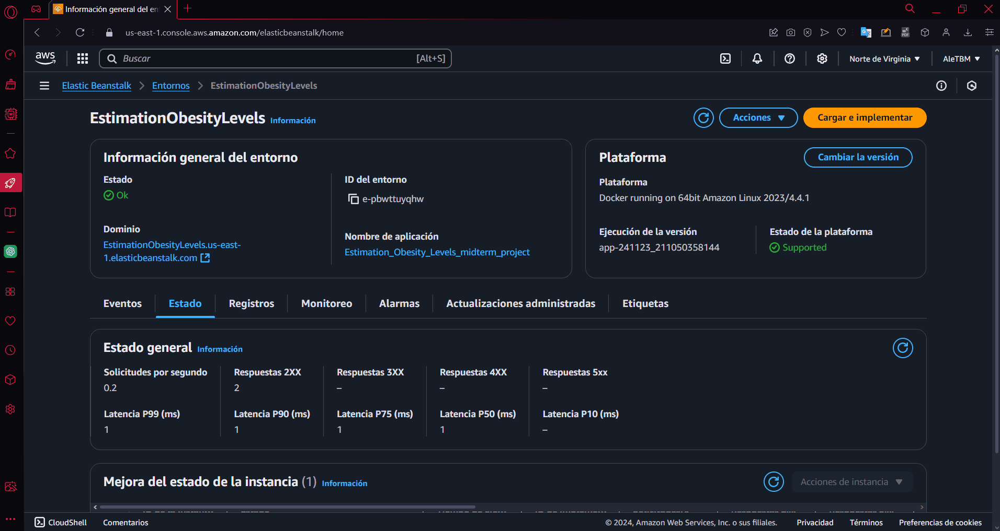

# Estimation of obesity levels based on eating habits and physical condition

This repository was created as part of [the DataTalks.Club's Machine Learning Zoomcamp](https://github.com/alexeygrigorev) by [Alexey Grigorev](https://github.com/alexeygrigorev).

This project has been submitted as the Midterm project for the course.

## Introduction

Obesity is a global problem, and an individual's eating habits and physical condition can provide insights into their health status. Poor eating habits and a lack of physical activity can lead to severe obesity, which may have fatal consequences.

In this project, I used data on individuals from Colombia, Peru, and Mexico obtained from the [UC Irvine Machine Learning Repository](https://archive.ics.uci.edu/dataset/544/estimation+of+obesity+levels+based+on+eating+habits+and+physical+condition). The dataset contains 17 attributes and 2,111 records, with each record labeled using the class variable `NObesity` (Obesity Level). This variable categorizes obesity levels into the following classes:
+ Insufficient Weight
+ Normal Weight
+ Overweight Level I
+ Overweight Level II
+ Obesity Type I
+ Obesity Type II
+ Obesity Type III

Seventy-seven percent of the data was generated synthetically using the Weka tool with the SMOTE filter, while 23% was collected directly from users via a web platform.

## Downloading the dataset

You can download the dataset using the following Python command:

```
wget https://archive.ics.uci.edu/static/public/544/estimation+of+obesity+levels+based+on+eating+habits+and+physical+condition.zip

unzip -o /content/estimation+of+obesity+levels+based+on+eating+habits+and+physical+condition.zip
```
Alternatively, you can access it from this repository:
```
wget https://raw.githubusercontent.com/aletbm/MySolutions_MLZoomcamp2024_DataTalks.Club/refs/heads/main/Estimation_Obesity_Levels_midterm_project/dataset/ObesityDataSet_raw_and_data_sinthetic.csv
```

## Dataset analysis and Training models

The dataset analysis and the models training were conducted in Jupyter Notebook. You can find this file in this [repository folder](https://github.com/aletbm/MySolutions_MLZoomcamp2024_DataTalks.Club/tree/main/Estimation_Obesity_Levels_midterm_project/analysis).

The training script for the selected model is available in this [repository file](https://github.com/aletbm/MySolutions_MLZoomcamp2024_DataTalks.Club/blob/main/Estimation_Obesity_Levels_midterm_project/scripts/train.py).

The pipeline to preprocess the dataset, along with the label encoder and the final model, was exported to a file named [obesity-levels-model.bin](https://github.com/aletbm/MySolutions_MLZoomcamp2024_DataTalks.Club/blob/main/Estimation_Obesity_Levels_midterm_project/model/obesity-levels-model.bin)

## Running the project locally

### Using Flask

The script to deploy the model using Flask is [predict.py](https://github.com/aletbm/MySolutions_MLZoomcamp2024_DataTalks.Club/blob/main/Estimation_Obesity_Levels_midterm_project/scripts/predict.py).

[Pipfile](https://github.com/aletbm/MySolutions_MLZoomcamp2024_DataTalks.Club/blob/main/Estimation_Obesity_Levels_midterm_project/Pipfile) and [Pipfile.lock](https://github.com/aletbm/MySolutions_MLZoomcamp2024_DataTalks.Club/blob/main/Estimation_Obesity_Levels_midterm_project/Pipfile.lock) set up the Pipenv environment. 

First, you need to install from [Pipfile](https://github.com/aletbm/MySolutions_MLZoomcamp2024_DataTalks.Club/blob/main/Estimation_Obesity_Levels_midterm_project/Pipfile):
```
pipenv install
```
The virtual environment can be activated by running
```
pipenv shell
```
Once in the virtual enviroment, you can run the following commands:
```
cd scripts
python predict.py
```
You can test the model by running:
```
python scripts/test.py
```
Don't forget to update the `url` variable in the [test.py](https://github.com/aletbm/MySolutions_MLZoomcamp2024_DataTalks.Club/blob/main/Estimation_Obesity_Levels_midterm_project/scripts/test.py) file to:
```
url = "http://localhost:9696/predict"
```
### Using Waitress as WSGI server

Once in the virtual enviroment, you can run the following commands:
```
cd scripts
waitress-serve --listen=0.0.0.0:9696 predict:app
```
You can test the model by running:
```
python scripts/test.py
```
Don't forget to update the `url` variable in the [test.py](https://github.com/aletbm/MySolutions_MLZoomcamp2024_DataTalks.Club/blob/main/Estimation_Obesity_Levels_midterm_project/scripts/test.py) file to:
```
url = "http://localhost:9696/predict"
```

### Local deployment with Docker

[Dockerfile](https://github.com/aletbm/MySolutions_MLZoomcamp2024_DataTalks.Club/blob/main/Estimation_Obesity_Levels_midterm_project/Dockerfile) contain the Docker instructions.

To build the container, you can run the following command:
```
docker build -t estimation-obesity-levels .   
```
To run it:
```
docker run -p 9696:9696 -it estimation-obesity-levels:latest
```
## Running the project remotely

### Remote deployment with Docker and AWS Elastic Beanstalk

Before to deploy, you need to install the dev-packages from [Pipfile](https://github.com/aletbm/MySolutions_MLZoomcamp2024_DataTalks.Club/blob/main/Estimation_Obesity_Levels_midterm_project/Pipfile):
```
pipenv install -d
```
And also, you need a AWS account, you can create it in this [link](https://signin.aws.amazon.com/signup?request_type=register).

After, you can run the following command to create a app in AWS Elastic Beanstalk with the EB CLI:
```
eb init
```
The EB CLI will prompt you with a series of questions:
+ ***Select a default region***: In my case, my account is configured to work in the **US East (N. Virginia)** region.
+ ***Select an application to use***: You can create a new application or use an existing one.
+ ***Enter Application Name**: For example,*"Estimation_Obesity_Levels_midterm_project"*.
+ ***It appears you are using Docker. Is this correct?***: In our case the answer is *'Yes'*.
+ ***Select a platform branch***: I selected *"Docker running on 64bit Amazon Linux 2023"*.
+ ***Do you want to set up SSH for your instances?***: I chose not to.

Next, you need to create a new environment:
```
eb create
```
Again, the EB CLI will prompt you with a series of questions:
+ ***Enter Environment Name***: You need to enter a enviroment name. For example, *"EstimationObesityLevels"*.
+ ***Enter DNS CNAME prefix***: Here, you can enter the domain name prefix. For example, *"EstimationObesityLevels"*.
+ ***Select a load balancer type***: In my case, I selected *"Application"*.
+ ***Would you like to enable Spot Fleet requests for this environment?***: My answer was *"Yes"*.
+ ***Enter a list of one or more valid EC2 instance types separated by commas***:
In this case I used AWS Elastic Beanstalk with the free tier, so I could only use a `t2` instance type, more specifically, `t2.micro`.

Finally, you have an application running on AWS Elastic Beanstalk. You need to go to the AWS console, search for Elastic Beanstalk, and click on the Environments section of your application. There, you can find the domain where your application was deployed. 

If you want to test my application, you must change the `url` variable in the [test.py](https://github.com/aletbm/MySolutions_MLZoomcamp2024_DataTalks.Club/blob/main/Estimation_Obesity_Levels_midterm_project/scripts/test.py) file to:
```
url = "http://estimationobesitylevels.us-east-1.elasticbeanstalk.com/predict"
```
and you need to run:

```
python scripts/test.py
```

Testing

